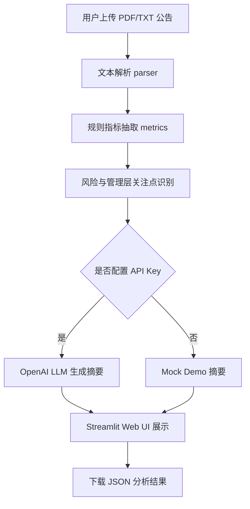

# EarningsLens

**中文名：上市公司公告/财报 AI 分析助手**

EarningsLens 是一个面向股票研究、AI 产品、商业分析、数据分析和投资研究实习场景的小型项目。它支持上传上市公司公告、财报 PDF 或文本文件，自动提取核心财务指标，并结合规则和 LLM 接口生成结构化摘要、风险点、管理层关注点和 200 字投研点评。

这个项目的目标不是直接给出买卖建议，而是辅助个人投资者和投研实习生更快读公告、抓重点、列风险清单。它展示了一个本科生能在 1-2 周内理解、复现并讲清楚的 AI 应用原型：从非结构化公告文本进入，到规则抽取、业务判断、模型摘要，再到可视化 Web UI 输出。

## 项目动机

上市公司公告和财报包含大量信息，但人工阅读耗时，且普通投资者容易只看到单个数字，忽略同比、环比、现金流、风险提示和管理层经营重点。EarningsLens 通过一个轻量化流程，把公告文本转成更适合股票研究、初步投研和面试展示的结构化结果。

适合放在简历中的原因：

- 贴近金融、数据分析和 AI 产品交叉场景
- 有真实可运行的 Web UI，而不是只写概念
- 逻辑足够清楚，面试时可以讲清数据流、规则设计和 LLM 使用边界
- 支持 mock/demo 模式，没有 API Key 也能演示完整流程

## 功能

- 上传 PDF、TXT、MD 格式的财报或公告
- 自动识别营业收入、归母净利润、毛利率、经营活动现金流量净额、每股收益等指标
- 提取同比和环比变化信息
- 基于关键词规则识别风险点和管理层关注点
- 支持 LLM 生成中文结构化摘要、风险点、管理层关注点和 200 字投研点评
- 未配置 API Key 时自动使用 mock/demo 模式
- 可下载 JSON 结构化结果

## 架构图



## 技术栈

- Python：核心分析逻辑
- Streamlit：简单 Web UI
- pypdf：PDF 文本提取
- pandas：表格展示
- python-dotenv：读取本地环境变量
- OpenAI SDK：可选 LLM 接口
- unittest：基础测试

## 快速开始

### 1. 克隆或进入项目

```bash
cd EarningsLens
```

### 2. 创建虚拟环境

```bash
python -m venv .venv
```

Windows:

```bash
.venv\Scripts\activate
```

macOS / Linux:

```bash
source .venv/bin/activate
```

### 3. 安装依赖

```bash
pip install -r requirements.txt
```

### 4. 配置环境变量

没有 API Key 也可以运行，默认使用 mock/demo 模式。

```bash
cp .env.example .env
```

如需使用真实 LLM：

```bash
LLM_PROVIDER=openai
OPENAI_API_KEY=你的_API_Key
OPENAI_MODEL=gpt-4o-mini
```

### 5. 启动应用

```bash
streamlit run app.py
```

打开浏览器中的本地地址，即可上传公告或使用示例数据进行分析。

## 示例数据

项目内置了一个示例公告：

```text
sample_data/sample_announcement.txt
```

示例文本包含营业收入、净利润、毛利率、经营现金流、每股收益、同比、环比、风险提示和管理层经营重点，便于快速演示完整流程。

## 功能截图占位说明

建议上传 GitHub 后，在 README 中补充以下截图：

1. 首页上传界面：展示文件上传区域和示例公告入口
2. 指标提取结果：展示营业收入、净利润、毛利率等表格
3. AI 分析结果：展示结构化摘要、风险点和 200 字投研点评

截图可放在：

```text
docs/images/
```

并在 README 中引用：

```markdown


```

## 测试

```bash
python -m unittest discover -s tests
```

当前测试覆盖：

- 财务指标、同比、环比抽取
- 风险点和管理层关注点识别
- 完整分析结果结构
- 表格格式化输出

## 项目结构

```text
EarningsLens/
├── app.py
├── earnings_lens/
│   ├── __init__.py
│   ├── llm.py
│   ├── metrics.py
│   ├── parser.py
│   └── report.py
├── sample_data/
│   └── sample_announcement.txt
├── tests/
│   ├── test_metrics.py
│   └── test_report.py
├── .env.example
├── .gitignore
├── README.md
└── requirements.txt
```

## 简历可用项目描述

- 搭建“上市公司公告/财报 AI 分析助手”，支持 PDF/TXT 文件上传、财务指标抽取、同比/环比识别和结构化投研摘要生成，辅助股票研究中从非结构化公告到风险清单的快速整理。
- 设计规则 + LLM 的混合分析框架，在无 API Key 时支持 mock/demo 模式，在有 API Key 时可调用大模型生成摘要、风险点、管理层关注点和 200 字投研点评，提升项目演示稳定性。
- 使用 Python、Streamlit、pypdf 和 pandas 实现可运行 Web 原型，并编写基础单元测试覆盖指标抽取、风险识别和结果格式化，体现 AI 产品落地与数据分析工程能力。

## 面试讲解思路

可以按这条线讲：

1. 为什么做：财报公告信息密度高，初学者需要更快抓住核心经营变化
2. 怎么做：PDF/TXT 解析、规则提取指标、关键词识别风险、LLM 生成结构化摘要
3. 产品边界：模型只做辅助总结，不捏造数据；关键指标来自可解释规则
4. 可扩展方向：接入 Wind/巨潮资讯、加入历史财报对比、行业横向比较、图表可视化、指标异常检测

## 未来计划

- 增加真实上市公司公告爬取入口
- 增加历史多期财报对比
- 增加同行业公司横向比较
- 增加收入、利润、现金流趋势图
- 增加导出 Word/PDF 投研速览报告
- 增加更细的财务指标词典和行业关键词库

## 免责声明

本项目仅用于学习、简历展示、产品原型演示和个人信息整理，不构成任何投资建议或买卖依据。实际投资决策应结合完整公告、审计报告、行业数据、估值水平、市场风险和专业判断。
